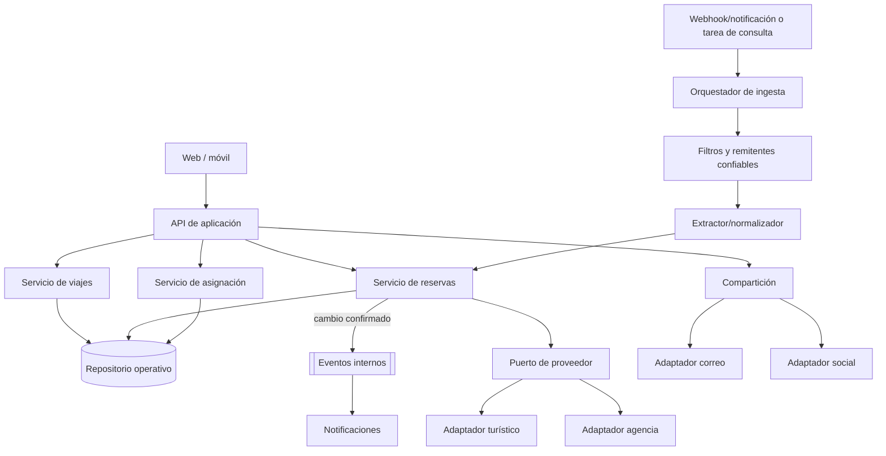

# Vista C&C — funcionalidad central (ADD-2)

```mermaid
flowchart TB
  CLIENT[Web / móvil] --> API[API de aplicación]
  API --> TRIPS[Servicio de viajes]
  API --> RES[Servicio de reservas]
  API --> ASSIGN[Servicio de asignación]
  TRIPS --> DB[(Repositorio operativo)]
  RES --> DB
  ASSIGN --> DB
  TRIGGER[Webhook/notificación o tarea de consulta] --> INGEST[Orquestador de ingesta]
  INGEST --> FILTER[Filtros y remitentes confiables]
  FILTER --> EXTRACT[Extractor/normalizador]
  EXTRACT --> RES
  RES -->|cambio confirmado| BUS[[Eventos internos]]
  BUS --> NOTIFY[Notificaciones]
  RES --> PORT[Puerto de proveedor]
  PORT --> TRAVEL[Adaptador turístico]
  PORT --> AGENCY[Adaptador agencia]
  API --> SHARE[Compartición]
  SHARE --> EMAIL[Adaptador correo]
  SHARE --> SOCIAL[Adaptador social]
```

Se prefieren notificaciones/webhooks si el proveedor los ofrece; la consulta periódica es fallback. No se presupone capacidad externa no documentada.
