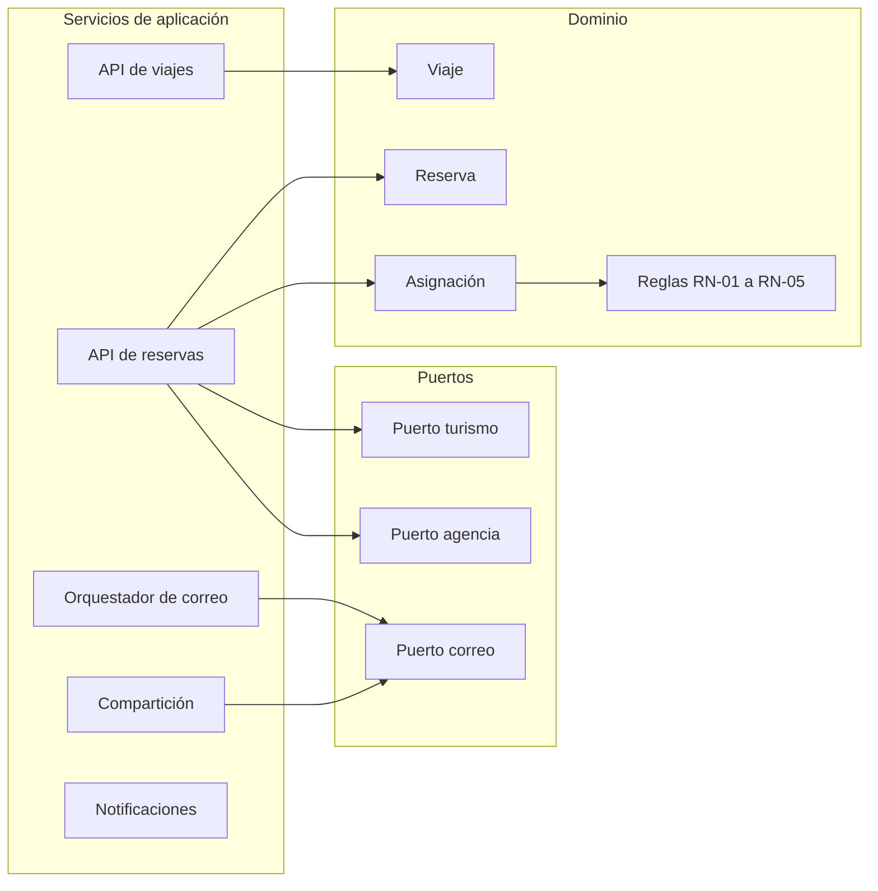

# Vista de módulos refinada — ADD-2

```mermaid
flowchart LR
  subgraph App[Servicios de aplicación]
    TRIPAPI[API de viajes]
    RESAPI[API de reservas]
    INGEST[Orquestador de correo]
    SHARE[Compartición]
    NOTIFY[Notificaciones]
  end
  subgraph Domain[Dominio]
    TRIP[Viaje]
    RES[Reserva]
    ASSIGN[Asignación]
    RULES[Reglas RN-01 a RN-05]
  end
  subgraph Ports[Puertos]
    MAILP[Puerto correo]
    TRAVELP[Puerto turismo]
    AGENCYP[Puerto agencia]
  end
  TRIPAPI --> TRIP
  RESAPI --> RES
  RESAPI --> ASSIGN
  ASSIGN --> RULES
  INGEST --> MAILP
  RESAPI --> TRAVELP
  RESAPI --> AGENCYP
  SHARE --> MAILP
```

Vista lógica: estos módulos pueden ser paquetes internos en un monolito modular del prototipo, manteniendo interfaces explícitas.
