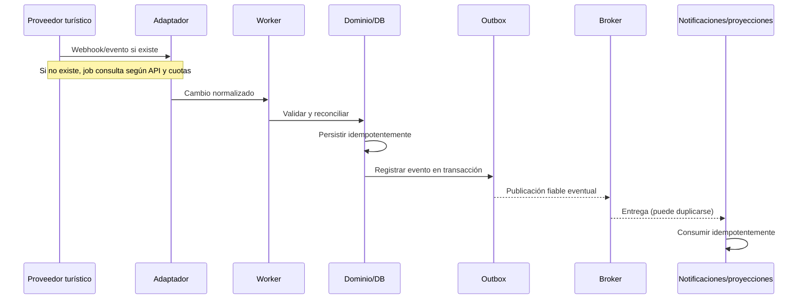

# Flujo de actualización de reserva — ADD-3

```mermaid
sequenceDiagram
  participant P as Proveedor turístico
  participant A as Adaptador
  participant W as Worker
  participant D as Dominio/DB
  participant O as Outbox
  participant B as Broker
  participant N as Notificaciones/proyecciones
  P->>A: Webhook/evento si existe
  Note over P,A: Si no existe, job consulta según API y cuotas
  A->>W: Cambio normalizado
  W->>D: Validar y reconciliar
  D->>D: Persistir idempotentemente
  D->>O: Registrar evento en transacción
  O-->>B: Publicación fiable eventual
  B-->>N: Entrega (puede duplicarse)
  N->>N: Consumir idempotentemente
```

Esquema conceptual; proveedor, protocolo, broker y precedencia entre cambio manual y externo quedan pendientes.
