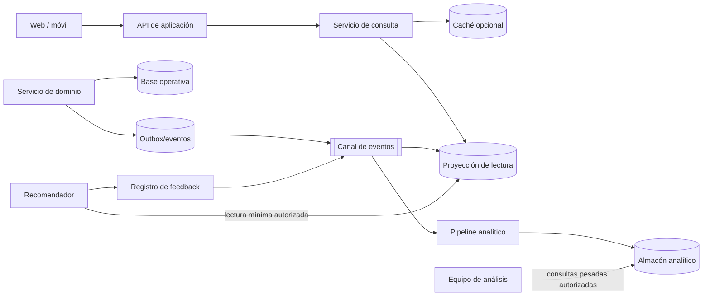

# Vista de lectura y analítica — ADD-4

```mermaid
flowchart LR
  CLIENT[Web / móvil] --> API[API de aplicación]
  API --> READ[Servicio de consulta]
  READ --> CACHE[(Caché opcional)]
  READ --> PROJ[(Proyección de lectura)]
  DOMAIN[Servicio de dominio] --> OP[(Base operativa)]
  DOMAIN --> OUTBOX[(Outbox/eventos)]
  OUTBOX --> BUS[[Canal de eventos]]
  BUS --> PROJ
  BUS --> PIPE[Pipeline analítico]
  PIPE --> DW[(Almacén analítico)]
  TEAM[Equipo de análisis] -->|consultas pesadas autorizadas| DW
  REC[Recomendador] -->|lectura mínima autorizada| PROJ
  REC --> FEEDBACK[Registro de feedback]
  FEEDBACK --> BUS
```

Las proyecciones pueden tener consistencia eventual; se debe medir el retraso máximo. La proyección no reemplaza la fuente de verdad operativa.
