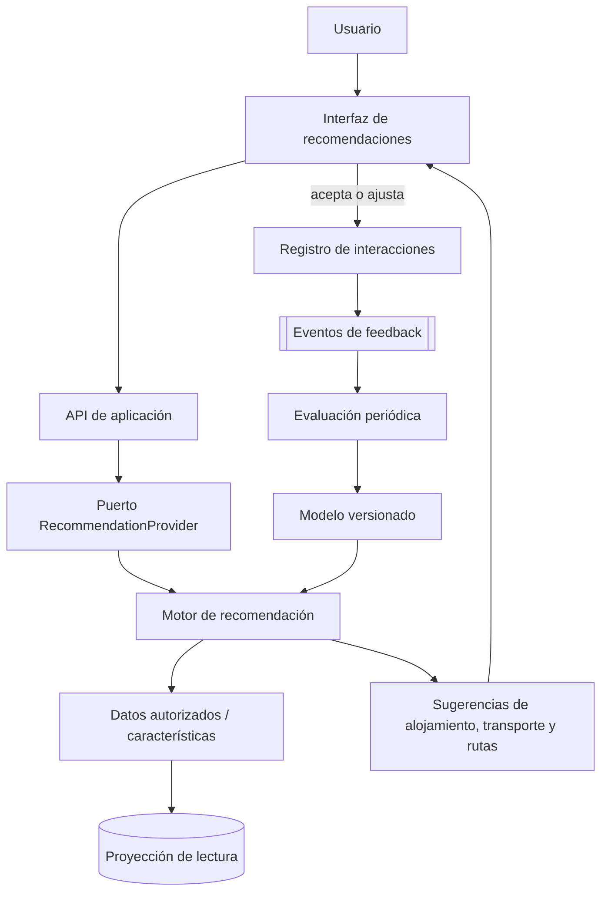

# Vista de recomendación — ADD-4

```mermaid
flowchart TB
  USER[Usuario] --> UI[Interfaz de recomendaciones]
  UI --> API[API de aplicación]
  API --> PORT[Puerto RecommendationProvider]
  PORT --> REC[Motor de recomendación]
  REC --> FEATURES[Datos autorizados / características]
  FEATURES --> READ[(Proyección de lectura)]
  REC --> SUGGEST[Sugerencias de alojamiento, transporte y rutas]
  SUGGEST --> UI
  UI -->|acepta o ajusta| FEEDBACK[Registro de interacciones]
  FEEDBACK --> EVENTS[[Eventos de feedback]]
  EVENTS --> EVAL[Evaluación periódica]
  EVAL --> MODEL[Modelo versionado]
  MODEL --> REC
```

Aceptar una sugerencia no modifica automáticamente una reserva sin acción explícita adicional. El contrato permite sustituir algoritmo sin alterar el núcleo.
